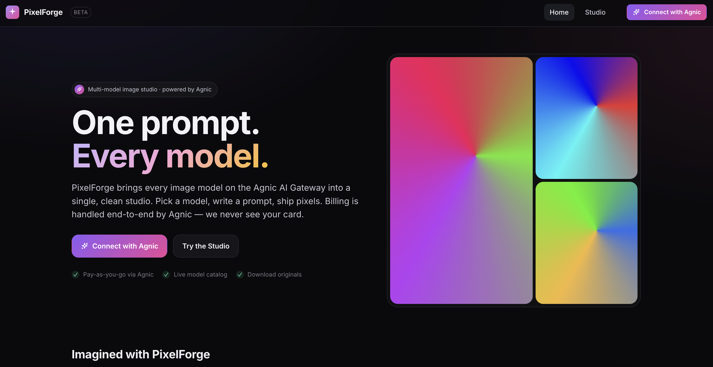

# PixelForge

> A reference implementation of a Freepik-style multi-model AI image studio
> built on the **Agnic AI Gateway**. Shows the complete pattern for partner
> apps that monetize through Agnic: OAuth + PKCE, the OpenAI-compatible
> gateway, live model catalog, partner attribution, balance reads, and the
> hosted top-up flow.

PixelForge is a thin partner app on top of Agnic. **Agnic is the Merchant of
Record** — it bills the end user directly and pays this app a partner revenue
share via the `X-Partner-Id` attribution header. PixelForge itself never
touches money, never stores card data, and never calculates user balances
client-side. The balance shown in the UI is read verbatim from Agnic's
`GET /api/balance`.



## The prompt that built this

This entire codebase was produced in a single Claude Code session from the
spec below. Click to expand — it's a useful template if you want to build
your own Agnic partner app.

<details>
<summary><b>Click to view the build prompt</b></summary>

````
You are an expert full-stack developer. Your task is to build a complete, runnable demo web app called "PixelForge" — a Freepik-style site where users generate images from multiple AI models.

<business_model>
The app is monetized entirely through Agnic. Agnic acts as the Merchant of Record (MoR), bills the end user directly, and pays this app a partner revenue share.
STRICT RULE: This app NEVER touches money, NEVER stores card data, and NEVER calculates or shows user balances.
</business_model>

<step_1_documentation>
READ THE DOCS BEFORE WRITING ANY CODE.
Do not start coding until you can restate the OAuth flow and the image-generation request shape.
- AI Gateway (Quickstart, Models, Image Gen): https://docs.agnic.ai/docs/ai-gateway | https://docs.agnic.ai/docs/ai-gateway/models | https://docs.agnic.ai/docs/ai-gateway/multimodal/image-generation
- Partner Program & Monetization: https://docs.agnic.ai/docs/partner-program | https://docs.agnic.ai/docs/partner-program/checkout
- Authentication (OAuth2): https://docs.agnic.ai/docs/authentication/oauth2
</step_1_documentation>

<integration_ground_truth>
Treat the following as absolute ground truth. Verify against docs if needed:
1. API Base: `https://api.agnic.ai/v1` (OpenAI-compatible)
2. Auth: End-user auth MUST use OAuth 2.0 Authorization Code + PKCE (S256). No client secret (public client). Use loopback/registered redirect URI from env.
3. Live Model Picker: Fetch from `GET https://api.agnic.ai/v1/models`. You MUST filter this list live to only show models where `output_modalities` includes "image".
4. Partner Attribution: You MUST send the header `X-Partner-Id: <AGNIC_CLIENT_ID>` on every generation call.
5. Token Security: Token exchange and refresh happen server-side. The `agnic_at_` token is NEVER exposed to the browser. Proxy calls to api.agnic.ai through the backend.
</integration_ground_truth>

<step_2_build_requirements>
Product UI/UX (Keep it minimal, STRICTLY NO feature creep):
- Landing Page: Hero section, sample gallery, "Generate" CTA.
- Connect Button: "Connect with Agnic" → triggers full OAuth2 + PKCE flow.
- Studio Page (Auth Required): Prompt box, live model picker, "Generate" button, result grid with download option. Display the selected model and request ID per image.
- Graceful States:
  - Not-connected.
  - Generating (loading state).
  - HTTP 402 (Insufficient credit) → Show exact message: "You're out of Agnic credit — top up at https://app.agnic.ai/topup". DO NOT invent a balance UI.
- Legal Footer: Must be visible in the UI footer and connect screen: "Payments and billing are handled by Agnic. You contract directly with Agnic; PixelForge never receives or holds your funds."

Tech Stack:
- Architecture: Single repo. One backend (Node/Express or Hono) + a React/Vite frontend.
- Run Command: Must be runnable with `npm install && npm run dev`.
- Database: NO database required (in-memory session for the demo is mandatory).
- Auth Providers: ONLY Agnic OAuth. Do not add any others.
- Environment Variables: `AGNIC_CLIENT_ID`, `AGNIC_REDIRECT_URI`, `AGNIC_API_BASE` (default https://api.agnic.ai). No hardcoded secrets.
</step_2_build_requirements>

<deliverables>
1. Working Code: Provide complete code. NO TODOs, NO placeholder functions, NO mocked API calls.
2. README.md: Include instructions for the ONE manual prerequisite (registering an OAuth client at https://app.agnic.ai/oauth-clients to obtain AGNIC_CLIENT_ID and set the redirect URI), the required env vars, and steps to run.
3. Verification Summary: Before declaring done, state exactly what you verified vs. assumed regarding the dev server, the PKCE challenge, the live /v1/models fetch, and the generation request body shape.
</deliverables>
````

Two features were added after the initial build via follow-up prompts:
balance display + hosted top-up flow (using
`GET /api/balance` and `https://app.agnic.ai/topup`), and a Freepik-inspired
visual redesign of the Studio. The original "no balance UI" rule was relaxed
once Agnic's authoritative balance endpoint was introduced as the source
of truth — PixelForge still does no client-side math.

</details>

## What this codebase demonstrates

- **OAuth 2.0 Authorization Code + PKCE (S256)** — public client, no client
  secret. Verifier is generated server-side; the access token never reaches
  the browser. See [backend/src/pkce.js](backend/src/pkce.js) and
  [backend/src/agnic.js](backend/src/agnic.js).
- **Server-side token storage** — in-memory signed-cookie sessions
  ([backend/src/sessions.js](backend/src/sessions.js)). The browser only
  ever sees an opaque `pf_sid`.
- **Transparent token refresh** — within 30 s of expiry the backend swaps
  the access token using the stored refresh token before forwarding the
  upstream call.
- **Live model catalog** — `GET /v1/models` fetched at runtime and filtered
  to those whose `architecture.output_modalities` includes `"image"`.
- **OpenAI-compatible image generation** — `POST /v1/chat/completions` with
  `modalities: ["image", "text"]` and `image_config.aspect_ratio`.
- **Partner attribution** — every billable gateway call carries
  `X-Partner-Id: <AGNIC_CLIENT_ID>`. Read-only calls (e.g. balance) do **not**
  send the header so partner analytics stay clean.
- **Hosted top-up** — deep-link to `app.agnic.ai/topup` as a 480×720 popup
  (desktop) or full-page redirect (mobile <640 px). Origin-locked
  `postMessage` listener refetches balance on completion; the mobile flow
  detects `?topup=success` on return and strips the query string.
- **Graceful 402 path** — `Insufficient credit` from the gateway surfaces as
  the exact mandated string plus an inline Top-up button.

## Stack

| Layer | Tech |
|---|---|
| Backend | Node 20+, Express 4 (ESM), `fetch` (no upstream SDK) |
| Frontend | Vite 5, React 18, `react-router-dom` |
| State | In-memory `Map`, signed-cookie sessions, **no database** |
| Auth | Agnic OAuth 2.0 Auth Code + PKCE |
| Run | `npm install && npm run dev` |

## Architecture at a glance

```
        ┌──────────────────────┐
Browser │  Vite dev (5173)     │  ──/api/*──>  ┌──────────────────────┐
        │  React UI            │               │  Express (5174)      │
        │  pf_sid cookie       │  <── 302 ──── │  - PKCE state        │
        └──────────────────────┘               │  - session store     │
                                               │  - token refresh     │
                                               │  - proxy + X-Partner │
                                               └──────────┬───────────┘
                                                          │
                                              api.agnic.ai│
                                                          │
                                   ┌──────────────────────▼───────┐
                                   │  /oauth/authorize  /token    │
                                   │  /v1/models  /v1/chat/...    │
                                   │  /api/balance  /topup        │
                                   └──────────────────────────────┘
```

The browser **never** holds an `agnic_at_…` token. Every authenticated call
goes through the local backend, which attaches the bearer header and the
partner-attribution header before forwarding.

---

## One manual prerequisite — register an OAuth client at Agnic

1. Go to **<https://app.agnic.ai/oauth-clients>** and create a new OAuth client.
2. Add both URIs below as **Authorized Redirect URIs** — they must match
   **exactly** the values in your `.env`:

   ```
   http://localhost:5174/api/auth/callback     (AGNIC_REDIRECT_URI)
   http://localhost:5173                       (AGNIC_TOPUP_RETURN_URL)
   ```

   The first is the OAuth callback. The second is the return target for the
   hosted top-up flow.
3. Copy the **Client ID** Agnic gives you (no client secret needed — this is
   a public client using PKCE). The same value is used as the `X-Partner-Id`
   attribution header on every gateway call.

## Setup

```bash
git clone https://github.com/agnicpay/PixelForge.git
cd PixelForge
cp .env.example .env
# Edit .env and fill in AGNIC_CLIENT_ID + a SESSION_SECRET
#   (openssl rand -hex 32)

npm install
npm run dev
```

Open **<http://localhost:5173>** and click **Connect with Agnic**. The
backend runs on `:5174`, the Vite frontend on `:5173`; Vite proxies `/api/*`
to the backend so the browser sees a single origin.

### Environment variables

| Var | Required | Default | Notes |
|---|---|---|---|
| `AGNIC_CLIENT_ID` | yes | — | From your Agnic OAuth client. Also sent as `X-Partner-Id` on every gateway call. |
| `AGNIC_REDIRECT_URI` | yes | — | Must **exactly** match a registered redirect URI. Suggested: `http://localhost:5174/api/auth/callback`. |
| `AGNIC_TOPUP_RETURN_URL` | no | `FRONTEND_ORIGIN` | Where Agnic's hosted top-up returns the user on mobile. Must **also** be registered on the OAuth client. |
| `AGNIC_API_BASE` | no | `https://api.agnic.ai` | Override only for a non-prod base. |
| `PORT` | no | `5174` | Backend port. |
| `FRONTEND_ORIGIN` | no | `http://localhost:5173` | Used for CORS and the post-login redirect target. |
| `SESSION_SECRET` | yes | — | 32+ random bytes (e.g. `openssl rand -hex 32`). Signs the session cookie. |

---

## How the OAuth flow actually works

1. User clicks **Connect with Agnic**. The browser navigates to
   `GET /api/auth/login` (backend).
2. The backend:
   - generates a 64-byte random `code_verifier`,
   - computes `code_challenge = base64url(SHA256(code_verifier))`,
   - generates a CSRF `state`,
   - stores both in a signed, HttpOnly session cookie (in-memory map; no DB),
   - redirects to
     `https://api.agnic.ai/oauth/authorize?...&code_challenge_method=S256`.
3. The user approves on Agnic. Agnic redirects to
   `http://localhost:5174/api/auth/callback?code=...&state=...`.
4. The backend verifies `state` matches the cookie, then POSTs to
   `/oauth/token` with `grant_type=authorization_code`, the code, the redirect
   URI, the client ID, and the `code_verifier`. **No client secret.**
5. The `access_token` (`agnic_at_…`) and `refresh_token` (`agnic_rt_…`) are
   stored in the server-side session. The browser only ever sees `pf_sid`.
6. The frontend now calls `/api/models` and `/api/generate` against its own
   backend, which attaches `Authorization: Bearer <access_token>` and
   `X-Partner-Id: <AGNIC_CLIENT_ID>` before forwarding upstream.

When an access token is within 30 s of expiry the backend transparently
refreshes it before forwarding.

## Balance & top-up flow

1. After connecting, the frontend calls `/api/balance`, which proxies
   `GET https://api.agnic.ai/api/balance` with the user's bearer token.
   `X-Partner-Id` is **not** sent on this read.
2. The response is forwarded as-is; the UI renders `creditBalance` verbatim
   formatted as USD. **No client-side math, no stored balance.**
3. **Top up** opens
   `https://app.agnic.ai/topup?client_id=<AGNIC_CLIENT_ID>&return_url=<AGNIC_TOPUP_RETURN_URL>`
   as a 480×720 popup (desktop) or full-page redirect (mobile <640 px).
4. **Desktop completion** — the popup posts a `window.message` from
   `https://app.agnic.ai`; the frontend strict-checks `ev.origin` and refetches.
5. **Mobile completion** — Agnic redirects back to
   `AGNIC_TOPUP_RETURN_URL?topup=success&session_id=…`. The app detects
   `topup=success` on load, refetches balance, and clears the query string via
   `history.replaceState`.
6. Balance is also refetched after every generation (success or 402).

---

## Project layout

```
pixelforge/
├── package.json               # workspace root; `npm run dev` runs both apps
├── .env.example
├── backend/
│   ├── package.json
│   └── src/
│       ├── server.js          # Express routes (/api/auth/*, /models, /generate, /balance)
│       ├── agnic.js           # OAuth + gateway HTTP client
│       ├── sessions.js        # in-memory signed-cookie sessions
│       ├── pkce.js            # PKCE verifier/challenge
│       └── config.js          # env loader
└── frontend/
    ├── package.json
    ├── vite.config.js         # proxies /api -> backend
    ├── index.html
    └── src/
        ├── main.jsx
        ├── App.jsx
        ├── styles.css
        ├── components/{BalanceBadge,Footer,Icons}.jsx
        └── pages/{Landing,Studio}.jsx
```

## What this app deliberately does NOT do

- No checkout, no card form — top-up is a deep-link to Agnic's hosted page.
- No stored balance — the displayed value always comes from a live
  `/api/balance` call. No app-side ledger, no math, no estimation.
- No database — OAuth sessions live in process memory and reset on restart.
- No other auth providers — only Agnic OAuth.
- No mock or placeholder API calls — every call hits `api.agnic.ai`.

## License

MIT — see [LICENSE](LICENSE).

## Built by

[Agnic](https://agnic.ai) · [Docs](https://docs.agnic.ai) · [Issues](https://github.com/agnicpay/PixelForge/issues)
